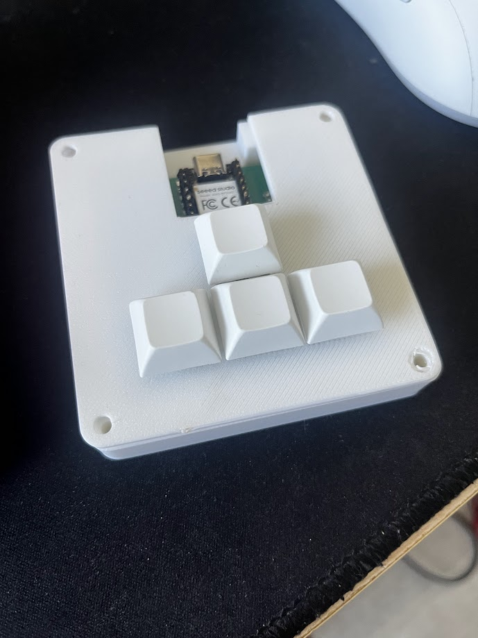

# darsh's hackpad
a 4 key keyboard built for tetris

## Features
 - 4 keys
 - Cherry MX Switches

## Built

## CAD Model
Made in Solidworks

## PCB
Made in KiCad

## Firmware Overview
Uses KMK firmware, keys mapped to the arrow keys

## BOM
 - 4x Cherry MX Switches
 - 4x DSA Keycaps
 - 4x M3x16mm SHCS Bolts
 - 1x XIAO RP2040
 - 1x Case (2 printed parts)
